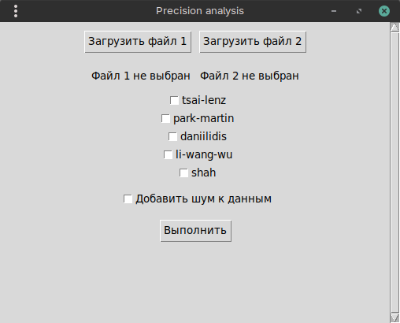
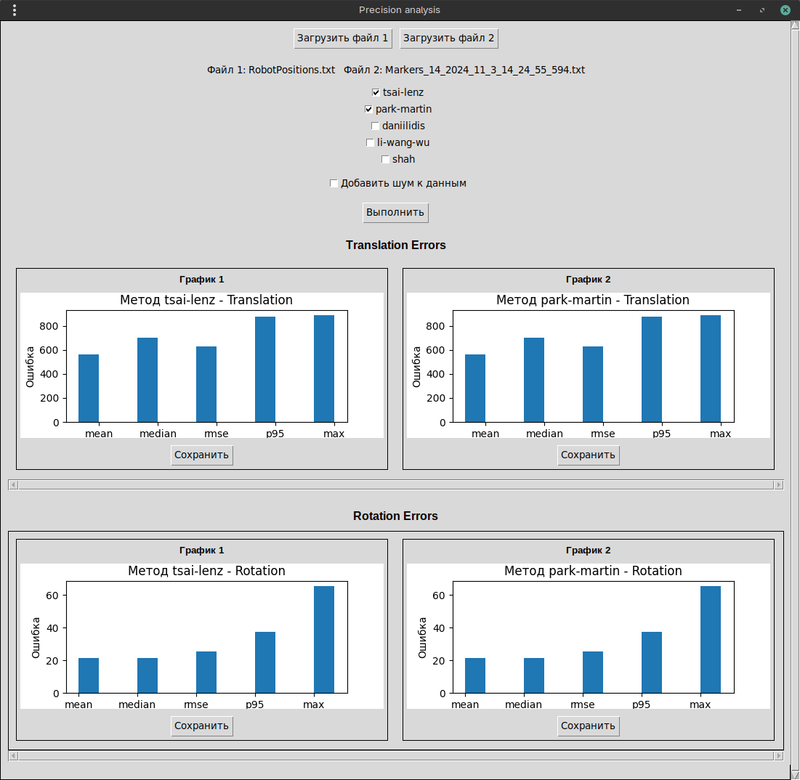
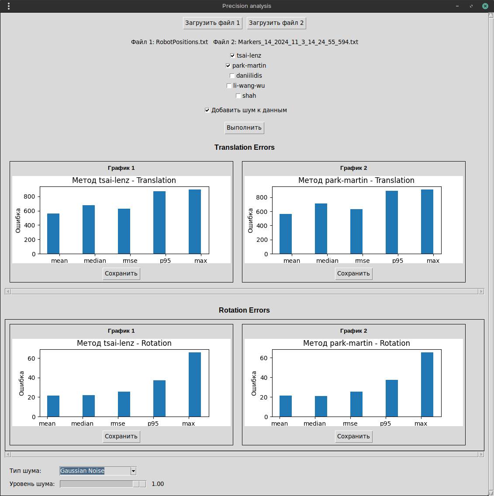

# Precision Analysis — Руководство пользователя

Это графическое приложение (GUI) предназначено для сравнения классических методов решения задач вида AX = XB и AX = YB.

Программа принимает на вход файлы с данными точек в формате id, X, Y, Z, RZ, RY, RX (в миллиметрах и градусах; углы заданы в порядке ZYX).

## Проблематика

Задачи калибровки вида **AX = XB** и **AX = YB** широко применяются в робототехнике, компьютерном зрении и системах навигации (например, калибровка системы "рука–глаз" и калибровка "робот–камера").  
На практике их решение связано с рядом принципиальных трудностей.

### Основные проблемы:

* **Наличие шума в измерениях**  
  Реальные данные содержат погрешности, обусловленные неточностями сенсоров, ошибками трекинга, калибровки камер, энкодеров и систем локализации. Эти ошибки проявляются как в трансляции, так и во вращении.

* **Чувствительность алгоритмов к типу шума**  
  Разные методы по-разному реагируют на некоррелированный случайный шум (гауссов шум) и коррелированные искажения (шум Перлина), что может приводить к существенно различным результатам при одинаковых исходных данных.

* **Устойчивость к выбросам и малому числу измерений**  
  Некоторые алгоритмы требуют большого количества пар преобразований для устойчивой работы и чувствительны к выбросам, что ограничивает их применимость в практических сценариях.

* **Сложность объективного сравнения методов**  
  В научных публикациях методы часто сравниваются на синтетических или специализированных наборах данных, что затрудняет выбор подходящего алгоритма для конкретной прикладной задачи.

Цель данного приложения — предоставить единый инструмент для объективного сравнения классических методов решения задач **AX = XB** и **AX = YB** на одинаковых данных, с возможностью контролируемого добавления шума и оценки точности по набору статистических метрик.



## Добавление шума к данным

В приложение добавлена возможность тестирования методов на зашумленных данных. Это позволяет оценить устойчивость алгоритмов к различным типам искажений.

## Типы доступного шума:

* Шум Перлина (Perlin Noise) — плавный "природный" шум, имитирующий органичные искажения (дрожание камеры, плавное движение)
* Гауссов шум (Gaussian Noise) — классический гауссовский шум с нормальным распределением (случайные погрешности сенсоров)

## Как использовать:

1. Загрузите два файла как обычно
   
2. Установите чекбокс "Добавить шум к данным"
3. Выберите тип шума из выпадающего списка
4. Отрегулируйте уровень шума с помощью ползунка (0.0 - нет шума, 1.0 - максимальный шум)
5. Нажмите "Выполнить" для анализа
   

## Принцип работы:

При включении шума данные из файла 2 будут модифицированы перед анализом.
Файл 1 остаётся неизменным, что позволяет оценить влияние шума на точность.

## Используемые методы

Приложение реализует и сравнивает пять классических методов:
* tsai-lenz [https://kmlee.gatech.edu/me6406/handeye.pdf]
* park-martin [https://ieeexplore.ieee.org/abstract/document/326576]
* daniilidis [https://journals.sagepub.com/doi/abs/10.1177/02783649922066213]
* li-wang-wu [https://academicjournals.org/journal/IJPS/article-full-text-pdf/20DFAEA30999]
* shah [https://asmedigitalcollection.asme.org/mechanismsrobotics/article-abstract/5/3/031007/474841/Solving-the-Robot-World-Hand-Eye-Calibration]

## Метрики оценки

* mean (среднее)
* median (медиана)
* rmse (корень из среднеквадратичной ошибки)
* p95 (95-й процентиль)
* max (максимальная ошибка)

## Как запустить программу

Чтобы запустить программу достаточно открыть в каталоге app нужный файл в соответстии с вашей системой

### Для Windows:
app.exe

### Для Linux:
app

## Инструкция по сборке

Если вы решили собрать проект сами то:

1. Убедитесь, что у вас установлен Python
2. Создайте виртуальное окружение, если его нет
   ```bash
   python -m venv venv
   ```
3. Активируйте виртуальное окружение:
   ### Для Windows (PowerShell или CMD):
   ```bash
   venv\Scripts\activate
   ```
   ### Для Linux/Mac:
   ```bash
   source venv/bin/activate
   ```
4. Установите все нужные зависимости одной командой:
   ```bash
   pip install -r requirements.txt
   ```
5. Запустите приложение командой из корня проекта:
   ```bash
   python .\src\app.py
   ```

## Тесты

### Запуск всех тестов
```bash
pytest tests/
```

### Запуск с подробным выводом
```bash
pytest tests/ -v
```

### Запуск конкретного файла с тестами
```bash
pytest tests/test_utils.py
```

### Запуск с оценкой покрытия кода
```bash
pytest tests/ --cov=src --cov-report=html
```

## Структура тестов

- `test_utils.py` - Тесты вспомогательных функций (преобразования, загрузка CSV, вычисление ошибок)
- `test_algorithms.py` - Тесты всех алгоритмов калибровки (tsai-lenz, park-martin, daniilidis, li-wang-wu, shah)
- `test_noise.py` - Тесты функций генерации шума (Perlin и Gaussian)
- `test_functions_call.py` - Тесты основных функций API
- `test_end_to_end.py` - Сквозные тесты с предварительно сгенерированными файлами тестовых данных
- `conftest.py` - Общие фикстуры pytest и конфигурация

## Понимание тестовых данных: Наборы данных A и B

### Что такое A и B?

Тестовые данные состоят из пар файлов (например, `known_transform_A.txt` и `known_transform_B.txt`):

- **Набор данных A**: Содержит позы, измеренные в системе координат A (например, в базовой системе координат робота)
- **Набор данных B**: Содержит **те же позы**, измеренные в системе координат B (например, в системе координат камеры/датчика)

### Ключевая концепция

**A и B представляют одну и ту же физическую траекторию, просто выраженную в разных системах координат.**

Каждая строка в файле A соответствует той же строке в файле B - они представляют одну и ту же физическую позу в один и тот же момент времени, но измеренную из разных систем отсчета.

### Математическая связь

Позы в системах A и B связаны соотношением:

```
B = Y⁻¹ @ A @ X
```

В тестовых данных Y обычно является единичной матрицей (для простоты), так что:
```
B = A @ X
```

Где:
- **A** = поза в системе координат A
- **B** = та же поза в системе координат B
- **X** = преобразование из системы A в систему B (то, что находят алгоритмы калибровки)
- **Y** = дополнительное преобразование (обычно единичное в тестовых данных)

### Пример из реального мира

Представьте руку робота, движущуюся в пространстве:
- **Система A**: Измерения от датчика базы робота
- **Система B**: Измерения от камеры, наблюдающей за роботом
- Оба датчика наблюдают **одно и то же движение**, но сообщают координаты в своих собственных системах отсчета
- Алгоритмы калибровки находят преобразование **X**, которое конвертирует между этими двумя системами

### Пример из тестовых данных

```
Поза 0:
  Система A: [0.00, 0.00, 0.00] мм
  Система B: [49.92, 100.02, 24.93] мм
  (Одно и то же физическое местоположение, разные системы координат)
```

### Задача калибровки

Имея пары поз (A_i, B_i) для i = 1...n, алгоритмы находят:
- **X**: Преобразование из системы A в систему B
- **Y**: Дополнительное преобразование (если необходимо)

Такое, что: `Y @ B_i = A_i @ X` для всех i

### Генерация тестовых данных

Тестовые данные генерируются скриптом `generate_test_data.py`:
1. Создание синтетических траекторий (известное преобразование, круговая, спиральная и т.д.)
2. Применение известного преобразования X между системами
3. Генерация соответствующих поз в обеих системах
4. Добавление шума к позам B для имитации реальных ошибок измерений
5. Сохранение файлов в формате: `id X Y Z RZ RY RX`

Сгенерированные файлы тестовых данных добавлены в репозиторий для воспроизводимости.

## Покрытие тестов

Набор тестов покрывает:
- ✅ Операции с матрицами преобразований (обращение, композиция)
- ✅ Преобразования углов Эйлера
- ✅ Загрузку и парсинг CSV-файлов
- ✅ Вычисление ошибок и статистику
- ✅ Все пять алгоритмов калибровки
- ✅ Генерацию шума (Perlin и Gaussian)
- ✅ Основные функции API

## Сквозные тесты

Файл `test_end_to_end.py` содержит комплексные сквозные тесты, которые:
- Загружают предварительно сгенерированные файлы тестовых данных из `tests/data/`
- Тестируют все алгоритмы калибровки на различных траекториях
- Проверяют результаты на соответствие пороговым значениям, специфичным для алгоритмов и уровней шума
- Тестируют с несколькими уровнями шума (0.1мм, 1.0мм, 5.0мм) для обеспечения надежности

### Файлы тестовых данных

Файлы тестовых данных находятся в `tests/data/` и включают:
- **Небольшие наборы данных**: `known_transform` (10 поз), `circular_trajectory` (8 поз)
- **Большие наборы данных**: `helix_trajectory`, `complex_3d_path`, `figure8_trajectory` (по 1000 поз)
- **Несколько уровней шума**: Каждый набор данных имеет варианты с шумом позиции 0.1мм, 1.0мм и 5.0мм

### Перегенерация тестовых данных

Если вам нужно перегенерировать файлы тестовых данных:

```bash
# Генерация всех тестовых случаев со всеми уровнями шума
python tests/generate_test_data.py --all-levels

# Генерация конкретного тестового случая с определенными уровнями шума
python tests/generate_test_data.py --test-case known_transform --noise-levels 0.1 1.0 5.0
```

## Примечания

- Некоторые алгоритмы (особенно Shah) могут не сходиться при определенных входных данных. Эти случаи корректно обрабатываются пропуском тестов.
- Тесты генерации шума пропускаются, если соответствующие модули недоступны.
- В тестах используются временные файлы, которые автоматически удаляются.
- Файлы тестовых данных добавлены в репозиторий (не генерируются на лету) для воспроизводимости и совместимости с CI/CD.

## Инструкция по использованию

### Загрузка файлов
* При запуске откроется окно приложения.
* Выберите 2 файла с точками в пространстве в указанном формате, используя кнопки "Загрузить файл 1" и "Загрузить файл 2".
* После успешной загрузки пути к выбранным файлам отобразятся рядом с кнопками.

### Выбор методов и запуск анализа
* Отметьте чекбоксы для методов, которые хотите применить. Можно выбрать один или несколько.
* Нажмите кнопку "Выполнить" для запуска вычислений и построения графиков.

### Просмотр графиков
* Графики точности (для трансляции и вращения) отобразятся в соответствующих разделах окна с возможностью горизонтальной прокрутки.
* Каждый график сопровождается заголовком и кнопкой "Сохранить" для экспорта изображения в PNG или PDF.

## Технические детали
* Приложение написано на Python с использованием Tkinter для графического интерфейса и matplotlib для визуализации графиков.
* Для генерации шума используются библиотеки noise (шум Перлина) и scipy (гауссов шум).
